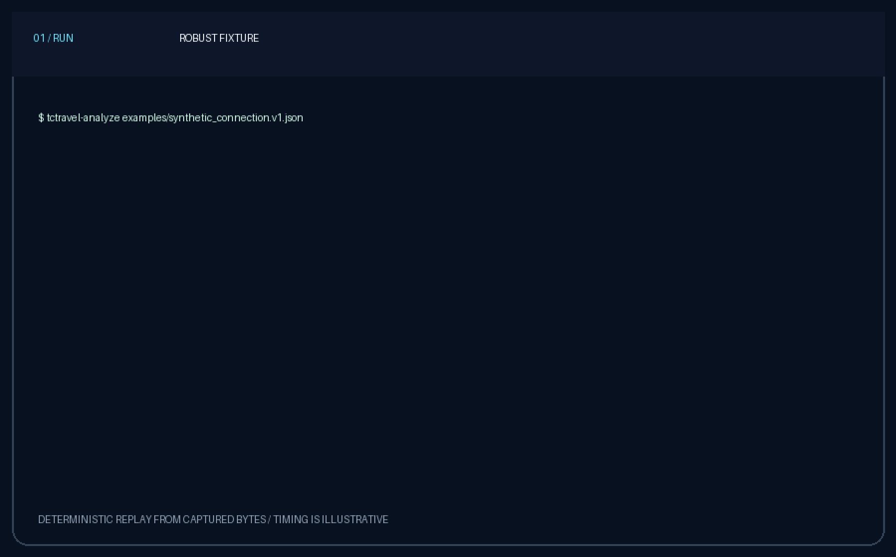
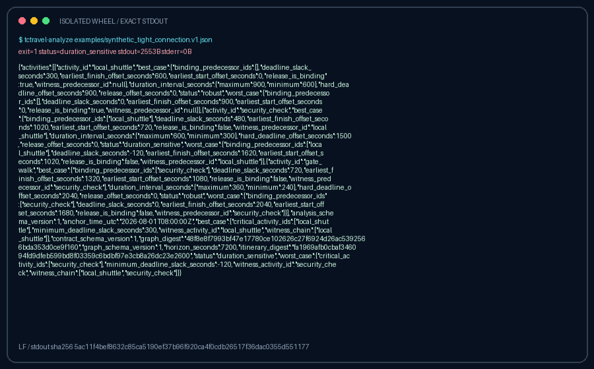
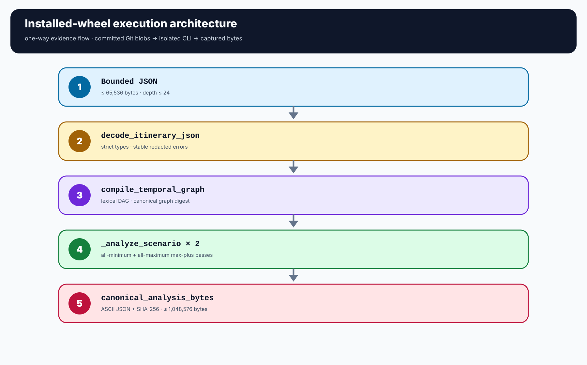
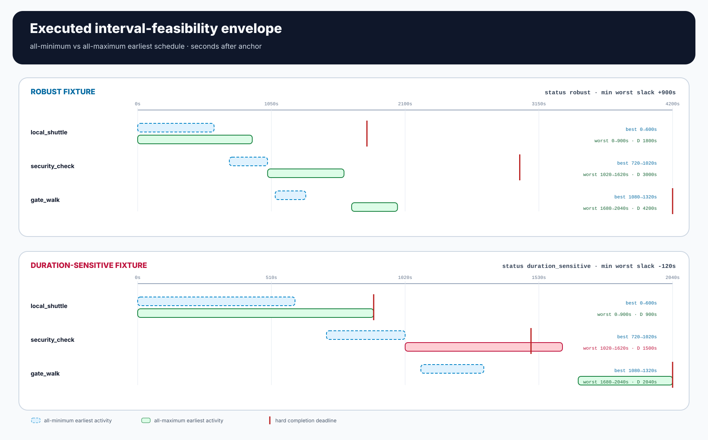
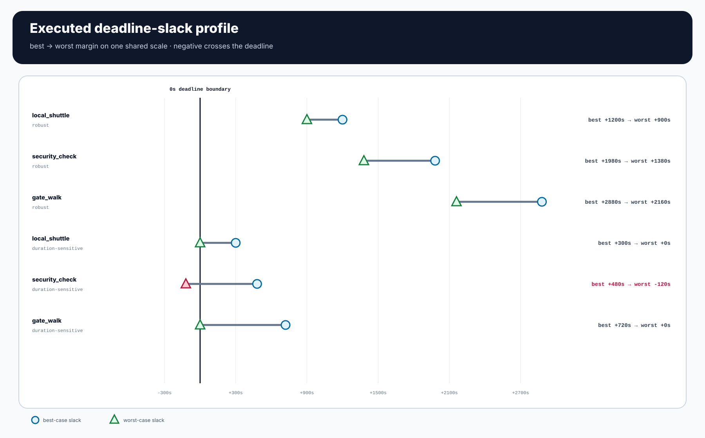
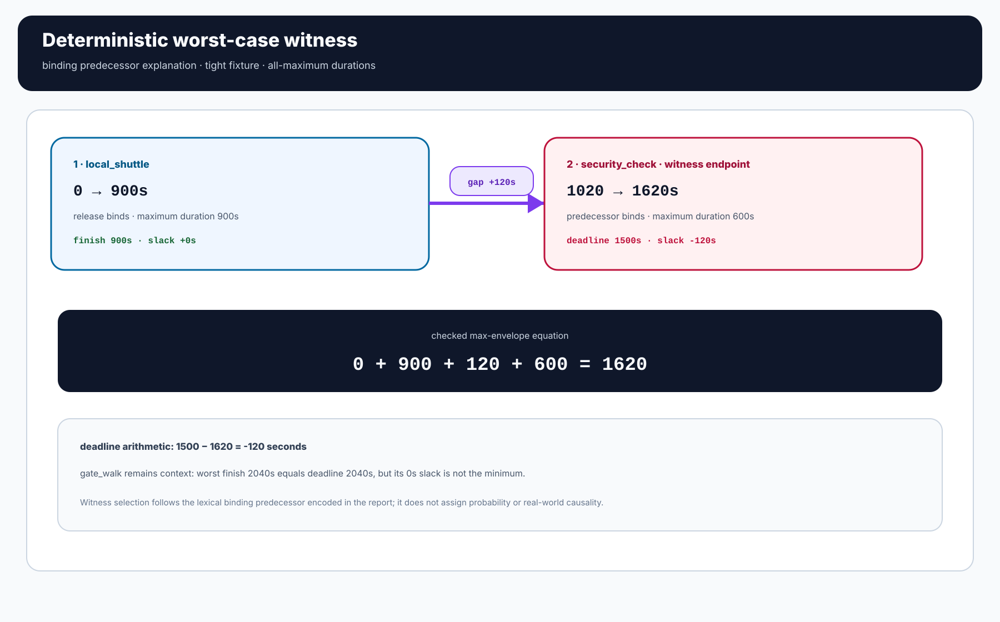
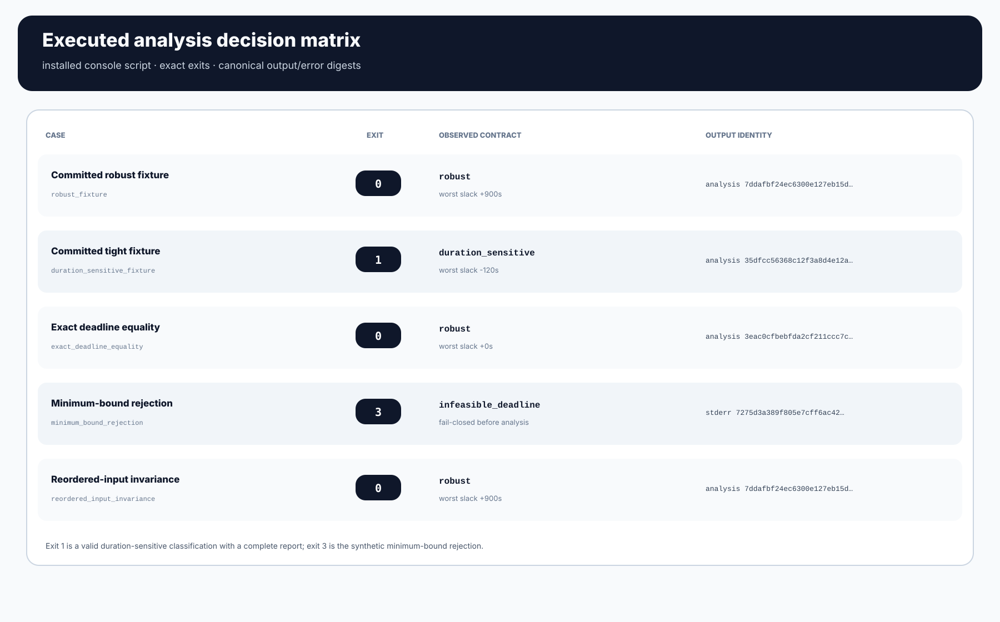
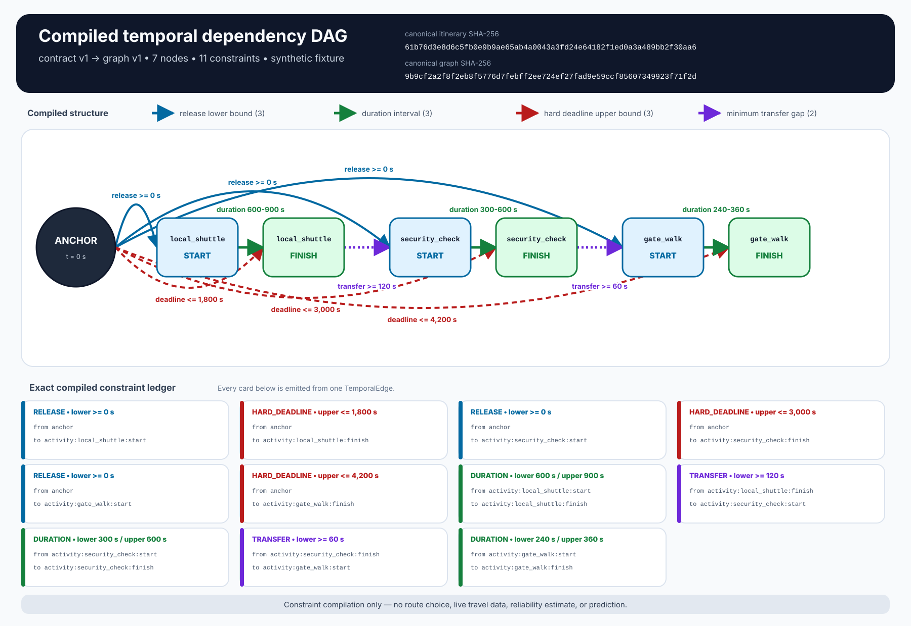
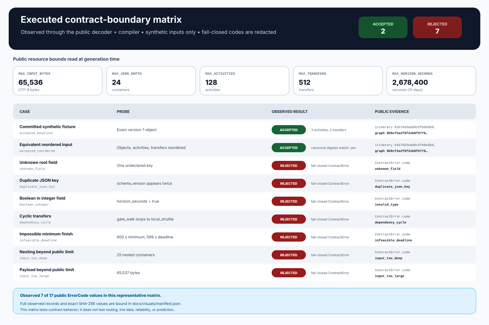

# TCTravel — Time-Critical Travel Compiler

[](https://github.com/omar07ibrahim/tctravel/actions/workflows/ci.yml)

TCTravel is a deterministic reliability engine for plans in which one late
step can invalidate everything downstream. It turns bounded activity
durations, hard completion deadlines, and transfer dependencies into a
validated DAG, computes best- and worst-case earliest-time envelopes, and
emits a canonical machine-readable decision with an auditable witness chain.

This is deliberately not a route finder, travel chatbot, or booking UI. The
implemented core is a focused reliability compiler with strict input limits,
stable failure codes, reproducible output identities, and an evidence pipeline
that exercises the installed wheel—not an in-tree mock.



*Real installed-wheel evidence.* The four GIF frames replay captured run
records. Values, exits, byte counts, and SHA-256 identities are observed; frame
timing is editorial and makes no performance claim.

## What it decides

For every activity, TCTravel runs the same deterministic earliest-start
recurrence at the minimum and maximum declared durations. Monotonicity makes
those two passes the interval envelope for all whole-second duration
combinations in the declared rectangular bounds.

- `robust`: every modeled duration combination meets every deadline under the
  earliest-start policy;
- `duration_sensitive`: the all-minimum schedule is valid, but at least one
  deadline is missed in the all-maximum envelope; and
- contract rejection: the submitted graph is malformed or already misses a
  deadline at minimum durations.

The report preserves all binding predecessors, selects one lexical witness for
stable explanation, and hashes canonical ASCII JSON. The digest identifies
exact report bytes; it does not certify that submitted durations are true.

## Executed evidence at a glance

These values come from the committed raw captures, not hand-written examples.

| Installed CLI case | Exit | Decision | Minimum worst-case slack | Witness |
| --- | ---: | --- | ---: | --- |
| [`synthetic_connection.v1.json`](examples/synthetic_connection.v1.json) | `0` | `robust` | `+900 s` | `local_shuttle` |
| [`synthetic_tight_connection.v1.json`](examples/synthetic_tight_connection.v1.json) | `1` | `duration_sensitive` | `-120 s` | `local_shuttle -> security_check` |

Exit `1` is a complete modeled result with canonical JSON on stdout, not an
execution failure. The evidence suite also executes exact-deadline equality,
minimum-bound rejection, and reordered-input invariance.



*Complete captured stdout.* The PNG renders every byte emitted by the installed
console script for the tight fixture. Wrapping is presentational; the exact
ASCII bytes are committed in
[`duration-sensitive.stdout.json`](docs/analysis-evidence/raw/duration-sensitive.stdout.json),
with a byte-bound
[`cli-terminal.svg`](docs/analysis-evidence/generated/cli-terminal.svg) vector
rendering as well.

## Architecture



The evidence path is intentionally stricter than a normal local demo:

1. an allowlist materializes 12 files from one full Git revision;
2. the project wheel is built with package-index access disabled;
3. all 14 wheel members, package blobs, metadata, entry point, and `RECORD` are
   checked exactly;
4. an outer pinned `pip` installs the wheel into a fresh, pipless virtual
   environment with no system or user site packages; and
5. the generated `tctravel-analyze` entry point executes five synthetic cases
   outside the source tree.

The published manifest binds the subject commit, subject tree, pipeline source
blobs, renderer contract, executions, decoded raster identities, and every
artifact hash.

## Read the result visually



*Feasibility envelope.* The two bars for each activity are computed from the
installed CLI reports. Deadline crossings are visible without hiding the exact
offsets.



*Deadline slack.* Both fixtures share one signed scale, so the tight case's
`-120 s` deadline miss is directly comparable with the robust margins.



*Witness chain.* This is the analyzer's deterministic binding-predecessor
explanation, not a probabilistic cause or a CPM critical-path claim.



*Decision matrix.* Exact exits, output identities, equality behavior, rejection
semantics, and canonical invariance are all observed executions.

## Quick start

TCTravel supports Python 3.11+ and has no runtime dependencies outside the
standard library.

```bash
python3 -m venv .venv
.venv/bin/python -m pip install .

.venv/bin/tctravel-analyze \
  examples/synthetic_connection.v1.json > robust.json

.venv/bin/tctravel-analyze \
  examples/synthetic_tight_connection.v1.json > tight.json || test "$?" -eq 1
```

Both output files are complete canonical reports. The module entry point is
equivalent:

```bash
.venv/bin/python -m tctravel examples/synthetic_connection.v1.json
```

The Python API exposes the same semantics without filesystem or network I/O:

```python
from pathlib import Path

from tctravel import decode_itinerary_json
from tctravel.analysis import analysis_digest, analyze_interval_feasibility

itinerary = decode_itinerary_json(
    Path("examples/synthetic_connection.v1.json").read_bytes()
)
report = analyze_interval_feasibility(itinerary)

print(report.status.value)  # robust
print(report.worst_case.minimum_deadline_slack_seconds)  # 900
print(analysis_digest(report))
```

## Reproduce the published evidence

The byte-for-byte renderer contract is intentionally narrow: CPython 3.12.3 on
Linux x86_64 with the exact hashed distributions in
[`requirements-evidence.txt`](requirements-evidence.txt). The library and CLI
remain supported on Python 3.11+; only canonical image bytes use the narrower
environment lock.

From a clean checkout with Python 3.12.3:

```bash
python3.12 -m venv .venv
.venv/bin/python -m pip install --require-hashes --no-deps -r requirements-evidence.txt
.venv/bin/python tools/generate_analysis_evidence.py --check
.venv/bin/python -m unittest discover -s tests -v
python3 tools/generate_visuals.py --check
python3 tools/verify_legacy.py --check
```

`--check` rebuilds the isolated wheel evidence in temporary storage, compares
all 8 visuals, raw runs, and the manifest byte for byte, and removes its work
directory. It does not rewrite the published bundle.

See [`docs/analysis-evidence.md`](docs/analysis-evidence.md) for the capture
chain, artifact inventory, exact identities, and review boundaries.

## Contract layers

| Layer | Implemented contract |
| --- | --- |
| Input | Strict JSON schema v1, duplicate-key rejection, depth/size/count caps, stable redacted errors |
| Graph | Immutable deterministic DAG, canonical ordering and SHA-256, cycle/reference/deadline validation |
| Analysis | Best/worst earliest-time envelopes, signed slack, binding sets, deterministic witness chain |
| CLI | Bounded path/stdin reads, canonical output, six documented exits, no network access |
| Distribution evidence | Exact source blobs, 14-member wheel allowlist, fresh isolated install, five installed executions |
| Legacy boundary | Fail-closed inventory and risk-count attestation without exposing inherited personal data |

The detailed contracts are:

- [`input-contract-v1.md`](docs/input-contract-v1.md)
- [`interval-feasibility-v1.md`](docs/interval-feasibility-v1.md)
- [`cli.md`](docs/cli.md)
- [`analysis-evidence.md`](docs/analysis-evidence.md)

## Earlier compiler evidence

The original compiler slice remains reproducible and is still checked in the
full test suite.



*Compiled DAG.* All seven nodes and eleven `TemporalEdge` records come from the
committed synthetic fixture; source and output digests are embedded.



*Contract boundary.* Each row is an observed public-API acceptance or stable
redacted rejection. Their exact source and output identities remain bound in
[`docs/visuals/manifest.json`](docs/visuals/manifest.json). Reproduce both
diagrams with:

```bash
python3 tools/generate_visuals.py --check
```

## Current boundary

Implemented now: strict decoding, graph compilation, deterministic interval
analysis, Python API, installed CLI, canonical reports, legacy attestation, and
source-bound visual evidence.

Not implemented or claimed: route search, live travel feeds, calibrated
probabilities, duration forecasting, optimization across candidate routes,
HTTP service, booking, recommendation, or real-world safety guarantees. The
fixtures are original synthetic contract examples, not observed journeys.

## Legacy quarantine

The inherited HTML and `site.json` are retained only as an attested historical
snapshot. Their prose, contact details, embedded media, and third-party marks
are excluded from the new code, fixtures, demos, and visuals. The verifier
reports counts and digests without printing those values.

See [`docs/legacy-provenance.md`](docs/legacy-provenance.md) and
[`legacy.manifest.json`](legacy.manifest.json) for the exact boundary.
