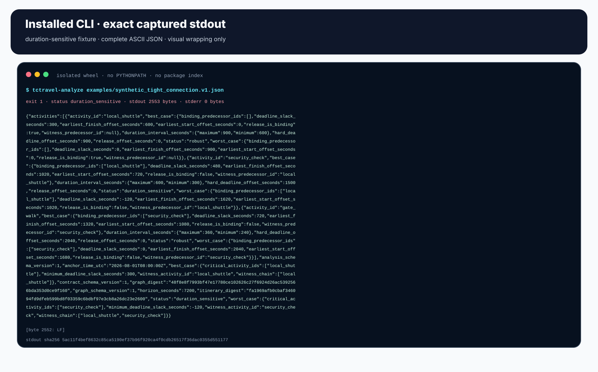

# Installed-wheel analysis evidence

This note documents the provenance of TCTravel's interval-feasibility visuals
and raw CLI captures. It defines what the bundle proves, how it is rebuilt, and
where its claims stop.


## Evidence claim

The bundle demonstrates that one exact TCTravel source revision can be built
into a tightly allowlisted wheel, installed into a fresh isolated environment,
and exercised through its generated console entry point with deterministic
results. The charts and demo are derived from those captured results.

The pinned subject is:

| Identity | Value |
| --- | --- |
| Subject commit | `7e9951e65941d05c6b757b1c2ade4f30af6cd9f8` |
| Subject tree | `381c6ed9bb7c6e2dc155a1b111cb6bca3d683476` |
| Evidence pipeline revision | `c7f0b5c1318170b13d5ba74d7fadecf7078371a1` |
| Distribution | `tctravel-temporal-compiler==0.3.0` |
| Console entry point | `tctravel-analyze = tctravel.cli:main` |

The subject is intentionally a full historical commit rather than the moving
working tree. The manifest binds each of its 12 allowlisted source/fixture
blobs and each evidence-pipeline source blob independently.

## Capture chain

The generator performs these checks before any visual is rendered:

1. Resolve the full subject commit and require it to be an ancestor of `HEAD`.
2. Materialize only the 12 allowlisted subject paths through `git archive`.
3. Build one wheel with `PIP_NO_INDEX=1`, no dependencies, no build isolation,
   a fixed locale/time zone/hash seed, and no inherited user Python path.
4. Require exactly 14 wheel members: nine package files and five distribution
   metadata files. Reject extra `.pth`, native-extension, duplicate, directory,
   or unexpected members.
5. Compare every packaged Python file to its pinned Git blob; validate
   `METADATA`, `WHEEL`, `entry_points.txt`, `top_level.txt`, and the complete
   `RECORD` surface with sizes and SHA-256 values.
6. Create a virtual environment with `--without-pip`, verify isolation, and use
   the outer pinned `pip --python` to install the wheel with `--no-index`,
   `--no-deps`, and `--no-compile`.
7. Run the installed `tctravel-analyze` script outside the source tree, check
   module-entry-point parity, parse canonical output, and record exits, byte
   counts, and SHA-256 identities.
8. Build presentation models only from those run receipts and render the
   published SVG, PNG, and GIF artifacts.

Subprocesses receive a fixed environment allowlist rather than a filtered copy
of the host environment. AWS credentials, proxy settings, `PYTHONPATH`, user
site packages, and pip configuration are not inherited.

## Observed executions


| Case | Input | Exit | Observed result |
| --- | --- | ---: | --- |
| `robust_fixture` | committed fixture | `0` | `robust`, best slack `+1200 s`, worst slack `+900 s`, witness `local_shuttle` |
| `duration_sensitive_fixture` | committed fixture | `1` | `duration_sensitive`, best slack `+300 s`, worst slack `-120 s`, witness `local_shuttle -> security_check` |
| `exact_deadline_equality` | derived tight fixture | `0` | equality is `robust`, worst slack `0 s` |
| `minimum_bound_rejection` | derived robust fixture | `3` | stable error code `infeasible_deadline` |
| `reordered_input_invariance` | reordered robust fixture | `0` | same canonical analysis digest and stdout identity as the original |

The two complete committed-fixture outputs are available as
[`robust.stdout.json`](analysis-evidence/raw/robust.stdout.json) and
[`duration-sensitive.stdout.json`](analysis-evidence/raw/duration-sensitive.stdout.json).
Their stderr captures are exactly zero bytes. The canonical receipts for all
five cases are in [`runs.json`](analysis-evidence/raw/runs.json).

## Visual inventory

Every row below is generated and hash-bound in
[`manifest.json`](analysis-evidence/manifest.json).

| Artifact | What it shows |
| --- | --- |
| [`analysis-workflow.svg`](analysis-evidence/generated/analysis-workflow.svg) | Installed-wheel stages and runtime bounds, with architecture labels checked against pinned source ASTs and blobs |
| [`analysis-decision-matrix.svg`](analysis-evidence/generated/analysis-decision-matrix.svg) | Five observed public decisions, exits, and output identities |
| [`cli-terminal.png`](analysis-evidence/generated/cli-terminal.png) | Complete tight-run stdout rendered from exact captured ASCII bytes |
| [`cli-terminal.svg`](analysis-evidence/generated/cli-terminal.svg) | Vector rendering of the same complete captured stdout |
| [`feasibility-envelope.svg`](analysis-evidence/generated/feasibility-envelope.svg) | Executed best/worst earliest starts and finishes against hard deadlines |
| [`deadline-slack.svg`](analysis-evidence/generated/deadline-slack.svg) | Best-to-worst slack values for both fixtures on one signed scale |
| [`critical-chain.svg`](analysis-evidence/generated/critical-chain.svg) | Tight fixture's lexical binding-predecessor witness and checked timing equation |
| [`cli-demo.gif`](analysis-evidence/generated/cli-demo.gif) | Four-frame replay of the two committed installed CLI runs |



The terminal image is a deterministic rendering of complete captured output,
not a photograph of a shell window. Line wrapping, typography, and GIF frame
timing are presentation choices. The underlying stdout, exits, values, and
hashes are observations.


## Reproduce or review

Canonical image bytes require the exact renderer contract recorded in the
manifest:

- CPython 3.12.3, CPython ABI `cpython-312-x86_64-linux-gnu`;
- Linux x86_64;
- Pillow 11.3.0 with the locked wheel and installed-tree identities;
- Python and Pillow zlib 1.3; and
- pinned `pip==26.2`, `setuptools==83.0.0`, and `wheel==0.47.0`.

Create a clean environment and run the read-only verifier:

```bash
python3.12 -m venv .venv
.venv/bin/python -m pip install --require-hashes -r requirements-evidence.txt
.venv/bin/python tools/generate_analysis_evidence.py --check
```

Expected output:

```text
TCTravel analysis evidence: PASS (verified 8 visuals + raw runs + manifest)
```

`--check` builds the bundle in `.evidence-work`, compares every published byte,
and cleans temporary content. It fails closed on source drift, pipeline drift,
environment drift, wheel-surface drift, installed-runtime drift, execution
drift, rendering drift, or manifest drift. It does not rewrite artifacts.

Maintainers intentionally regenerate only from a clean worktree:

```bash
.venv/bin/python tools/generate_analysis_evidence.py --write
```

The write command is not needed to review a matching bundle.

## What the evidence does not prove

- Fixtures are original synthetic contract examples, not live travel records.
- “Worst case” means all declared maximum durations, fixed minimum transfer
  gaps, and the deterministic earliest-start policy.
- Duration intervals are bounds, not calibrated probability distributions.
- A digest identifies bytes; it does not establish input truth, authorship, or
  real-world safety.
- The GIF timing is illustrative and says nothing about execution latency.
- TCTravel does not yet perform route search, live-data lookup, duration
  forecasting, stochastic calibration, optimization, booking, or
  recommendation.

The inherited website snapshot is outside this pipeline. It is neither read
nor archived, and its prose, contact values, media, and third-party marks do
not appear in the evidence bundle.
